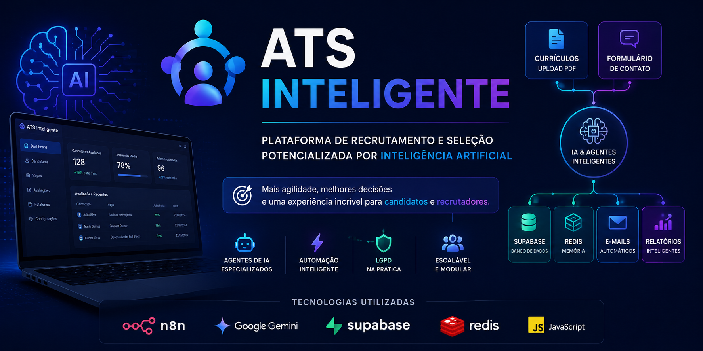

  

<h1 align="center">ATS Inteligente</h1>

Plataforma de recrutamento e seleção baseada em Inteligência Artificial.

# ATS Inteligente

> Plataforma de recrutamento e seleção baseada em Inteligência Artificial para automatizar a análise de currículos, o gerenciamento de candidatos e o atendimento inteligente.

O **ATS Inteligente** é um projeto desenvolvido para demonstrar como Inteligência Artificial e automação podem transformar o processo de recrutamento e seleção.

A plataforma automatiza desde o recebimento de currículos até a comunicação com candidatos, reduzindo atividades operacionais e apoiando a tomada de decisão por meio de agentes especializados de IA.

Atualmente o projeto é composto por dois módulos integrados:

### 📄 Avaliação Inteligente de Currículos

Workflow responsável por analisar currículos recebidos em PDF, comparar o perfil do candidato com a descrição da vaga e gerar um relatório técnico contendo recomendações para o recrutador.

Principais funcionalidades:

- Extração automática do conteúdo do currículo
- Comparação entre currículo e descrição da vaga
- Avaliação utilizando múltiplos agentes especializados
- Auditoria da qualidade do currículo
- Geração de relatório executivo
- Cadastro e atualização automática de candidatos
- Envio automático do resultado por e-mail

---

### 📬 Gerenciamento Inteligente de Contato

Workflow responsável pelo tratamento das solicitações enviadas através do portal do ATS.

Principais funcionalidades:

- Classificação automática das solicitações utilizando IA
- Tratamento de solicitações relacionadas à LGPD
- Consulta e gerenciamento de candidatos no banco de dados
- Exclusão automática de cadastros quando solicitado
- Respostas automáticas utilizando e-mails profissionais em HTML
- Atendimento totalmente automatizado

---

## Objetivos do Projeto

Este projeto foi desenvolvido com o objetivo de demonstrar a aplicação prática de Inteligência Artificial, automação de processos e integração entre sistemas para apoiar áreas de Recursos Humanos, recrutamento e seleção.

Além da automação operacional, a solução busca oferecer uma experiência mais ágil tanto para candidatos quanto para recrutadores, mantendo uma arquitetura modular preparada para futuras evoluções.

## 🏗️ Arquitetura Simplificada

O ATS Inteligente foi projetado de forma modular, permitindo que diferentes fluxos de automação trabalhem de maneira independente, mas integrados através de uma arquitetura baseada em Inteligência Artificial, banco de dados centralizado e automações desenvolvidas em n8n.

Atualmente a plataforma é composta por dois módulos principais:

### 📄 ATS CV Evaluation

Responsável pela avaliação inteligente de currículos utilizando múltiplos agentes especializados.

Fluxo resumido:

Currículo (PDF)
→ Extração de texto
→ Agentes de IA
→ Comparação CV × Vaga
→ Relatório
→ Supabase
→ E-mail

---

### 📬 ATS Contact Management

Responsável pelo gerenciamento inteligente das solicitações enviadas pelos candidatos.

Fluxo resumido:

Formulário
→ Classificação por IA
→ Regras de negócio
→ Supabase
→ Redis
→ E-mail

## 🏗️ Arquitetura Geral

O ATS Inteligente foi estruturado em dois fluxos principais: um para avaliação inteligente de currículos e outro para gerenciamento de contatos, solicitações e LGPD.

```mermaid
flowchart TD
    A[Usuário / Candidato] --> B[Portal ATS Inteligente]

    B --> C[Workflow 1: Avaliação de Currículos]
    B --> D[Workflow 2: Gerenciamento de Contato]

    C --> C1[Upload do Currículo PDF]
    C1 --> C2[Extração do Conteúdo]
    C2 --> C3[Agente IA: Match CV x Vaga]
    C3 --> C4[Agente IA: Auditoria do Currículo]
    C4 --> C5[Agente IA: Relatório Final]
    C5 --> C6[Cadastro ou Atualização no Supabase]
    C6 --> C7[E-mail com Resultado da Análise]

    D --> D1[Formulário de Contato]
    D1 --> D2[Classificação por IA]
    D2 --> D3{Tipo de Solicitação}

    D3 --> D4[Informações / Proposta / Suporte]
    D3 --> D5[Solicitação LGPD]

    D4 --> D6[Agente IA: Resposta Personalizada]
    D6 --> D7[Template HTML via JavaScript]
    D7 --> D8[E-mail Automático]

    D5 --> D9[Consulta no Supabase]
    D9 --> D10{Cadastro Encontrado?}
    D10 -->|Sim| D11[Exclusão do Cadastro]
    D10 -->|Não| D12[Notificação de Cadastro Não Localizado]

    D11 --> D13[E-mail de Confirmação]
    D12 --> D13

    C6 --> E[(Supabase)]
    D9 --> E
    D11 --> E

    C3 --> F[Google Gemini]
    C4 --> F
    C5 --> F
    D2 --> F
    D6 --> F

    C3 --> G[(Redis Memory)]
    C4 --> G
    C5 --> G
    D6 --> G
```

## 🛠️ Tecnologias Utilizadas

O ATS Inteligente foi desenvolvido utilizando uma arquitetura baseada em automação, Inteligência Artificial e serviços em nuvem. Cada tecnologia foi escolhida para atender a uma responsabilidade específica dentro da solução.

| Tecnologia | Finalidade |
|------------|------------|
| **n8n** | Orquestração dos workflows, integração entre serviços e automação dos processos. |
| **Google Gemini** | Agentes de Inteligência Artificial responsáveis por classificação, análise, auditoria e geração de respostas. |
| **Supabase** | Banco de dados para armazenamento e gerenciamento de candidatos, vagas e solicitações. |
| **Redis** | Gerenciamento de memória conversacional entre os agentes de IA. |
| **JavaScript** | Tratamento de dados, transformação de informações e geração de templates HTML. |
| **Gmail API** | Envio automatizado de notificações e relatórios por e-mail. |
| **Lovable** | Desenvolvimento da interface web do ATS e formulários de interação com candidatos. |
| **GitHub** | Versionamento do código, documentação técnica e portfólio do projeto. |

### Princípios adotados

Durante o desenvolvimento da plataforma foram adotados alguns princípios de arquitetura:

- Arquitetura modular baseada em workflows independentes.
- Separação entre regras de negócio, apresentação e Inteligência Artificial.
- Utilização de agentes especializados para responsabilidades distintas.
- Reutilização de componentes para facilitar manutenção e evolução da solução.
- Integração centralizada utilizando n8n como camada de orquestração.
